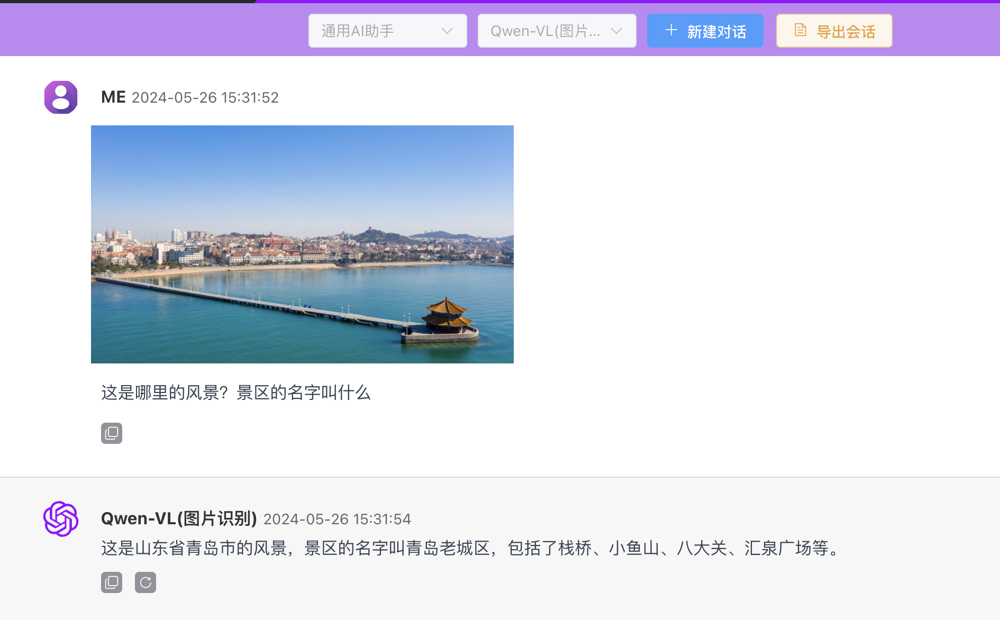
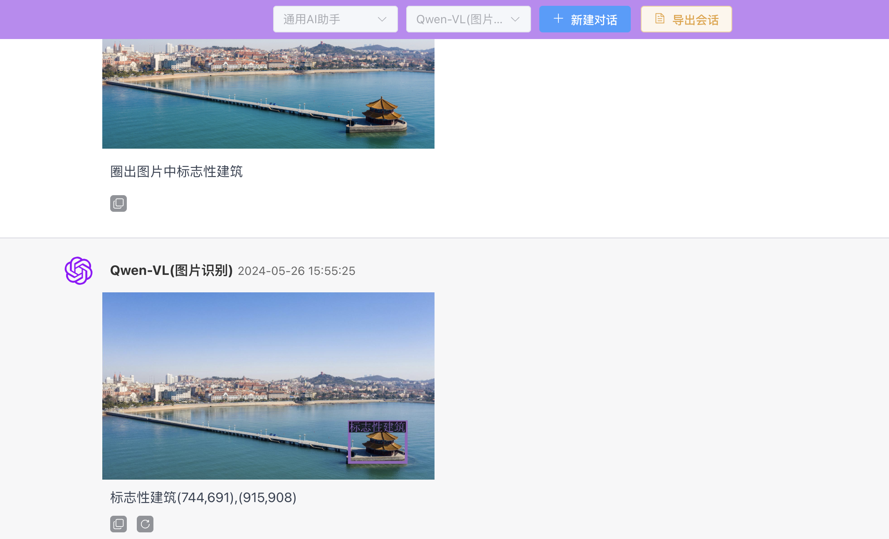

## 
本项目(本平台)仅供学习交流，请勿将制作内容用于非法活动或违反他人隐私的场景

### 网站域名
[**aigconline.net**](http://aigconline.net/)

### 一、功能介绍
主要功能有文生图，图生图及GPT对话，所有AI功能并非对接厂商API接口实现

### 二、开源组件
|         开源项目名          |                            仓库地址                             |   功能    |
|:----------------------:|:-----------------------------------------------------------:|:-------:|
|    stablediffusion     |     https://github.com/Stability-AI/stablediffusion.git     | 文生图/图生图 |
| stable-diffusion-webui | https://github.com/AUTOMATIC1111/stable-diffusion-webui.git | 文生图/图生图 |
|         ollama         |            https://github.com/ollama/ollama.git             |   GPT   |
|       facechain   |       https://github.com/modelscope/facechain.git            |  AI写真   |
### 三、NVIDIA GPU型号及数量
| 型号        | 数量  |    用途     |
| :--------:   |:---:|:---------:|
| NVIDIA GeForce RTX 4090     | * 卡 |  文生图/图生图  |
| NVIDIA RTX A5000       | * 卡 |    GPT    |
| NVIDIA RTX A5000       | * 卡 | facechain |
### 四、大语言模型
| 模型名        |              型号              | 所属公司 |
| :--------:   |:----------------------------:|:----:|
| 通义千问     |      Qwen1.5-110B-Chat       |  阿里  |
| 零一万物     |       Yi-1.5-34B-Chat        | 零一万物 |
| Llama 3     |       Meta-Llama-3-8B        | Meta |
| 通义千问    |         Qwen-VL-Chat         |   阿里   |
### 五、图片识别功能

### 六、体验交流群

## 七、Star History
